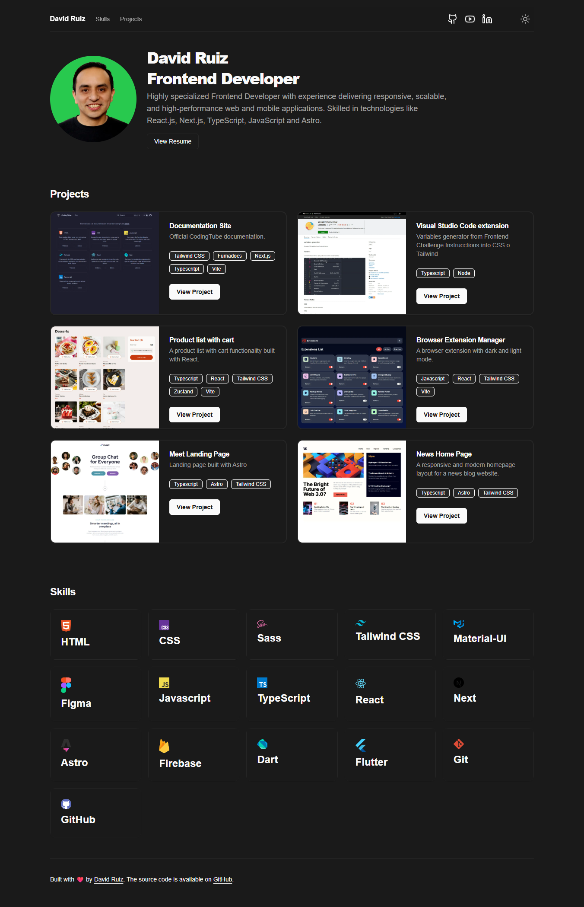

# Portfolio David Ruiz

This project is a personal portfolio built with Next.js, Vite, and Tailwind CSS.



## Installation

1. Install dependencies:

```bash
npm install
```

## Development

```bash
npm run dev
```

## Production Build

```bash
npm run build
```

## Production Preview

```bash
npm run preview
```

## Author

David Ruiz - Frontend Developer
- [Github](https://github.com/Davichobits)
- [Frontend Mentor](https://www.frontendmentor.io/profile/Davichobits) 
- [Linkedin](https://www.linkedin.com/in/davidirc/)
- [YouTube](https://www.youtube.com/CodingTube)
- [codingtube.dev](https://codingtube.dev/)

## GitAds Sponsored
[](https://gitads.dev/v1/ad-track?source=davichobits/davichobits@github)

