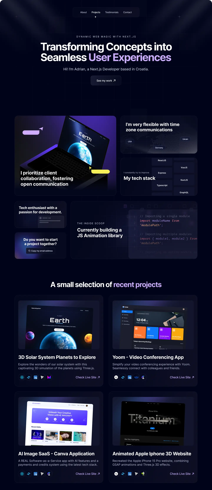

# David Ruiz Portfolio - Frontend Developer

This project was created to showcase my skills as a frontend developer.

## Preview



It is created with the following technologies:

## ⚙️ Tech Stack

- Next.js
- Three.js
- Framer Motion
- Tailwind CSS

## How to run the project

First, install dependencies:

```bash
npm install
```

Then, run the development server:

```bash
npm run dev
```

Open [http://localhost:3000](http://localhost:3000) with your browser to see the result.

You can start editing the page by modifying `app/page.tsx`. The page auto-updates as you edit the file.